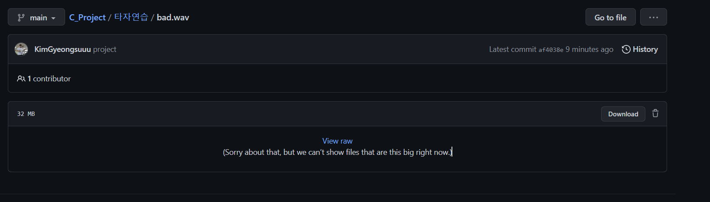

# C언어 프로젝트
### 영어 타자연습
+ C언어 프로젝트에서 만든 영어타자연습입니다.

### 플레이 방법
1. [타자연습](https://github.com/KimGyeongsuuu/C_Project/tree/main/%ED%83%80%EC%9E%90%EC%97%B0%EC%8A%B5)에 들어가서 음악 파일을 클릭하면 다음과 같은 화면이 나옵니다.

2. 가운데 파란색인 `View raw` 또는 오른쪽에 `Download`를 눌러주시면 음악이 다운로드 됩니다.

3. 다운로드 받은 것을 하나의 새로운 폴더에 저장해줍니다.

4. exe파일을 실행하면 게임이 시작됩니다.

모두 다운로드 받는데 시간이 5~6분 정도 소모됩니다.

